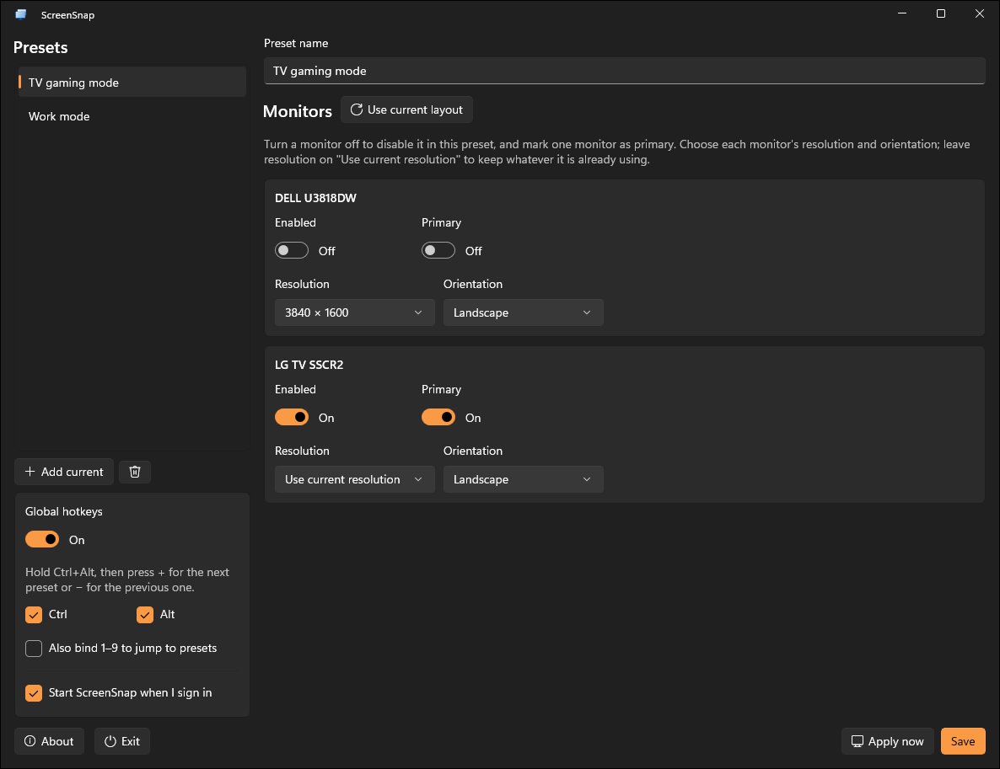

# ScreenSnap

A lightweight Windows tray utility that switches between saved **display-configuration presets** —
which monitors are enabled, which one is primary, and how they extend — from a taskbar menu or a
global keyboard shortcut.

Built for the everyday "desk vs. couch" flip: enable the desk monitors for work, then with one
click (or a hotkey) disable them and light up the TV for gaming.

<p align="center">
  
</p>

## Features

- **Taskbar tray icon** with a right-click menu listing every preset, plus **Settings** and **Exit**.
- **Per-monitor presets** — each preset records, for every attached display, whether it's enabled,
  which one is primary, its resolution, and its orientation.
- **Global hotkeys** — cycle presets without leaving your game or app:
  **Ctrl + Alt + `+`** for the next preset, **Ctrl + Alt + `-`** for the previous one
  (main-row and numpad keys both work). The modifier chord is configurable; an optional
  **Ctrl + Alt + 1…9** jumps straight to a preset.
- **Settings window** to capture the current layout as a preset, rename/reorder/delete presets,
  tweak per-monitor options, and apply a preset live.
- **Switch notifications** — a tray balloon confirms each switch and surfaces failures
  (e.g. a monitor that's no longer attached).
- **Start with Windows** (optional) via the per-user `Run` key.
- **Minimal dependencies** — native Windows APIs are called through
  [Microsoft.Windows.CsWin32](https://github.com/microsoft/CsWin32) (source-generated P/Invoke);
  there's no third-party UI or interop framework.

## How it works

The display engine uses the Windows **Connecting and Configuring Displays (CCD)** APIs
(`QueryDisplayConfig` / `SetDisplayConfig`) to enable/disable specific displays, set the primary
monitor, set each display's resolution and orientation, and position extended displays. The list
of selectable resolutions per monitor comes from `EnumDisplaySettingsEx`. Monitors are identified
by their stable device path so presets keep working across reconnects and reboots.

The tray icon is a classic `Shell_NotifyIcon` on a hidden message-only window, and global hotkeys
are registered with `RegisterHotKey` on that same window — no global keyboard hook, so it coexists
cleanly with Windows' own shortcuts. (The original idea of `Win+S` was dropped because Windows
reserves it for Search.)

## Getting started

### Install

Download the latest installer from the [**Releases**](https://github.com/alex-oswald/ScreenSnap/releases)
page and run it:

| Architecture | File |
| --- | --- |
| 64-bit (Intel/AMD) | `ScreenSnap-<version>-x64.msi` |
| ARM64 | `ScreenSnap-<version>-arm64.msi` |

The installer is **self-contained** — it bundles the .NET and Windows App SDK runtimes, so there's
nothing else to install. It installs per-user (no admin prompt) under
`%LocalAppData%\Programs\ScreenSnap` and adds a Start Menu shortcut. To remove it, use
**Settings → Apps**.

> Not sure which one? Most PCs are x64. Choose arm64 only on ARM devices such as Snapdragon-based
> Copilot+ PCs or a Surface Pro X.

#### Upgrading

Just run the newer MSI — it upgrades your existing install in place. There's no need to uninstall
first, you'll still have a single entry in **Settings → Apps**, and your presets and settings under
`%LocalAppData%\ScreenSnap` are preserved. If ScreenSnap is running when you start the upgrade,
the installer will close it for you.

#### Windows SmartScreen / Smart App Control

Until the project has signed releases set up, Windows will warn that the publisher is unverified:

- **SmartScreen** ("Windows protected your PC"): click **More info → Run anyway**.
- If the downloaded file is blocked, right-click the MSI → **Properties** → tick **Unblock** → **OK**.
- **Smart App Control** (Windows 11) is stricter — if SAC is on in **Enforcement** mode it will
  block the unsigned MSI outright. Either switch SAC to **Evaluation** or **Off** in
  **Windows Security → App & browser control → Smart App Control settings**, or wait for a signed
  release.

Once code signing is enabled in the release workflow (see
[`docs/signing.md`](docs/signing.md)), these warnings will go away.

## Building from source

### Prerequisites

- Windows 10 version 1809 (build 17763) or later.
- [.NET SDK 10](https://dotnet.microsoft.com/download) (the app targets `net10.0-windows10.0.19041.0`).
- The [Windows App SDK 2.2 runtime](https://learn.microsoft.com/windows/apps/windows-app-sdk/downloads)
  (the unpackaged app needs the runtime installed).

### Build

```powershell
# from the repository root
dotnet build ScreenSnap.slnx -c Debug
```

The executable is produced at
`src\ScreenSnap\bin\x64\Debug\net10.0-windows10.0.19041.0\ScreenSnap.exe`.

### Run

Launch `ScreenSnap.exe`. No window appears at startup — look for the ScreenSnap icon in the
notification area (you may need to expand the tray overflow). Right-click it to switch presets or
open **Settings**; double-click opens Settings directly.

To create your first preset: arrange your displays the way you want using Windows, open
**Settings → “Add current”**, give it a name, and repeat for each layout. Then switch between them
from the tray menu or with **Ctrl + Alt + `+`/`-`**.

### Run tests

```powershell
dotnet test tests\ScreenSnap.Core.Tests\ScreenSnap.Core.Tests.csproj -c Debug -p:Platform=x64
```

### Releasing

Releases are built by the [`Release`](.github/workflows/release.yml) GitHub Actions workflow. Pushing
a `vMAJOR.MINOR.PATCH` tag builds self-contained MSIs for x64 and arm64 and publishes them as a
GitHub Release:

```powershell
git tag v1.2.3
git push origin v1.2.3
```

The MSIs are packaged from `installer/ScreenSnap.wxs` with the [WiX Toolset](https://wixtoolset.org/).
You can also trigger the workflow manually (**Actions → Release → Run workflow**) to produce test
artifacts without publishing a release.

## Where data is stored

Presets and settings live under `%LOCALAPPDATA%\ScreenSnap`:

- `presets.json` — your saved display configurations.
- `settings.json` — hotkey chord, enabled toggles, and the start-with-Windows preference.

## Project layout

| Project | Purpose |
| --- | --- |
| `src/ScreenSnap.Core` | Display engine (CCD via CsWin32), preset/settings models + JSON stores, and service interfaces. No UI or packaging dependencies. |
| `src/ScreenSnap` | The WinUI 3 tray app: tray icon, global hotkeys, Settings window, autostart, app lifecycle. |
| `tests/ScreenSnap.Core.Tests` | xUnit tests for preset/settings serialization and cycling logic. |

The split is deliberate: `ScreenSnap.Core` knows nothing about WinUI or how the app is deployed.
Packaging-specific behavior sits behind interfaces (`IStorageLocations`, `IAutostartService`), so a
future **MSIX** build can swap the `%LOCALAPPDATA%` storage for `ApplicationData` and the registry
`Run` key for the `StartupTask` API without touching the core.

## Tech stack

- **WinUI 3** / Windows App SDK 2.2 (unpackaged)
- **.NET 10** (`net10.0-windows10.0.19041.0`), C#
- **Microsoft.Windows.CsWin32** for source-generated native interop
- Windows **CCD** display APIs, `Shell_NotifyIcon`, `RegisterHotKey`

## Roadmap

- MSIX packaging with `StartupTask`-based autostart.
- A custom tray menu / WinUI flyout for richer preset previews.
- Rebindable per-preset hotkeys.

## License

No license has been chosen yet.
